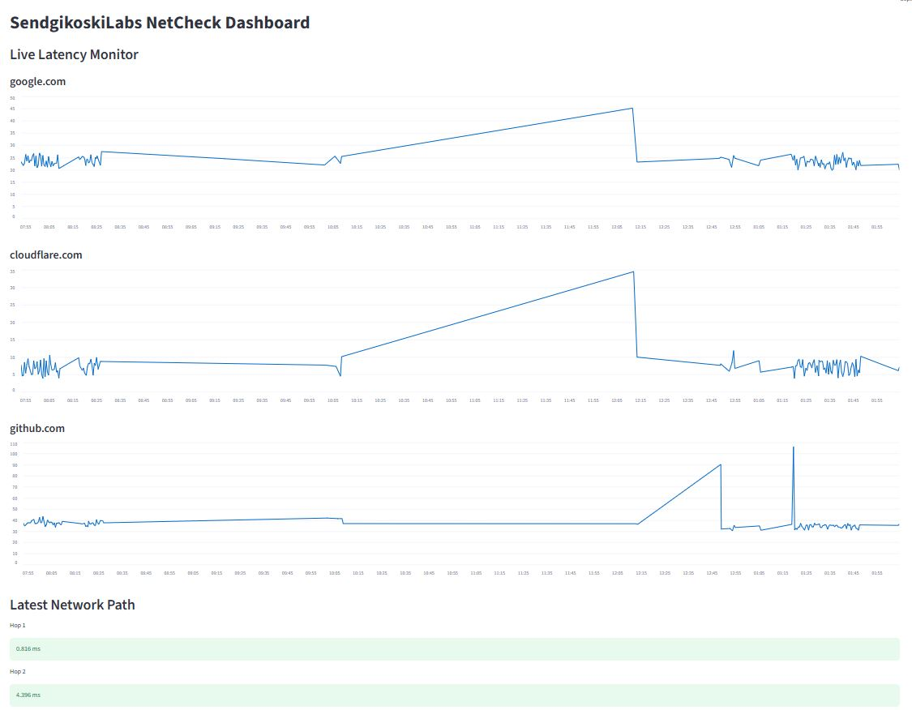

# NetCheck

NetCheck is a lightweight network diagnostics tool developed by SendgikoskiLabs.

NetCheck v1.5

Features
--------
✔ Ping monitoring
✔ Latency spike detection
✔ Automatic traceroute
✔ Slow-hop detection
✔ ISP filtering detection
✔ CSV logging
✔ Streamlit dashboard

Example of Streamlit Dashboard:

Example of continuous watch:
    $ python3 src/netcheck.py --watch
        Monitoring network every 30 seconds...

        [14:31:03] google.com      20.2 ms
        [14:31:03] cloudflare.com  8.78 ms
        [14:31:03] github.com      31.6 ms

Example of a one-time check:
  $ python3 src/netcheck.py
        SendgikoskiLabs NetCheck v1.5

        ==============================
         SendgikoskiLabs NetCheck
        ==============================

        Target Host : google.com
        Resolved IP : 64.233.177.100
        Ping Latency: 21.8 ms  [OK]
        HTTP Status : 200  [OK]
        ----------------------------------
        Target Host : cloudflare.com
        Resolved IP : 104.16.132.229
        Ping Latency: 7.03 ms  [OK]
        HTTP Status : 200  [OK]
        ----------------------------------
        Target Host : github.com
        Resolved IP : 140.82.114.4
        Ping Latency: 32.5 ms  [OK]
        HTTP Status : 200  [OK]
        ----------------------------------

        Diagnostics completed in 2.07 seconds

        ==============================

This project is the first component of the upcoming NetWatch network diagnostics toolkit.

